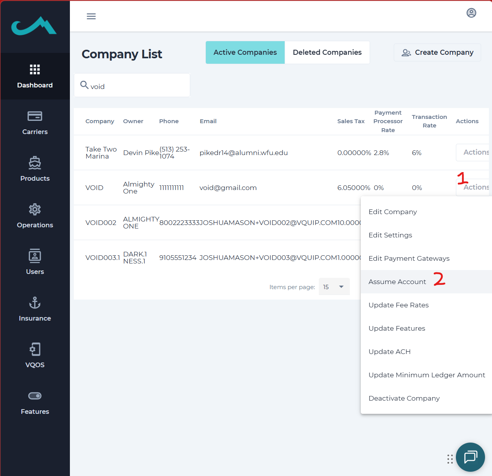
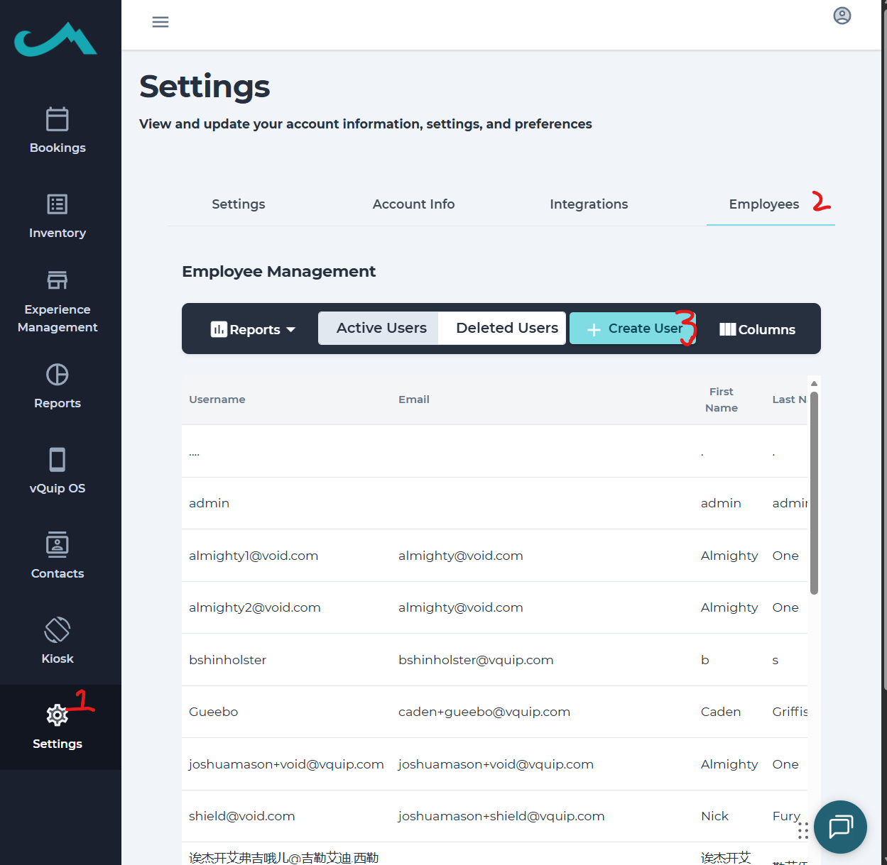

# VQuip Playwright Tests

Automated tests for the VQuip application using Playwright. Tests support multiple environments (dev, stage, mobile/Pendo) with configurable URLs and credentials. The **recommended primary test** is **employee reservation create-and-launch**: a full E2E flow (create reservation → check-in → guest registration → insurance/payment → launch → end-rental) on the Pendo mobile web app.

## Prerequisites

- **Node.js** 18 or higher
- **npm** (comes with Node)

## Setup

### 1. Install dependencies

```bash
npm install
```

### 2. Install Playwright browsers

```bash
npm run install-browsers
```

Or:

```bash
npx playwright install
```

### 3. Environment configuration

- **Dev and Stage**: Use the built-in config in `config/environments.ts`. No extra setup.
- **Mobile (Pendo)**: Used by the employee reservation create-and-launch test. Create a `.env` file in the project root with your own credentials.

**Getting test credentials:** Create an employee in **VQuip Admin** for the **VOID** company (**245**) in the **dev** environment. Use that employee’s **username** (not email) and password in `.env` so you never store real or shared passwords in the repo.

1. **Log in to VQuip Admin (dev):** [https://dev-admin.vquiprentals.com/auth/v2/vquipadmin/login](https://dev-admin.vquiprentals.com/auth/v2/vquipadmin/login)
2. **Open VOID and assume the account:** On the Company List, search for “void”, find **VOID**, open the **Actions** menu, and choose **Assume Account** so you’re acting as that company.
3. **Create an employee:** Go to **Settings** → **Employees**. Click **+ Create User** and create an employee. Set a **Username** and password you’ll use only for testing. The test uses the employee **username** (and password), not the email—see the Username column in the employee table.
4. Optionally create or use a business admin user for the same company if your tests need it.



*Step 2: Find VOID on the Company List and use Actions → Assume Account.*



*Step 3: Settings → Employees. Use “+ Create User” and use the employee’s **Username** (not email) for `E_USERNAME` in `.env`.*

Then create a `.env` file in the project root with the variable names and your own values:

```env
COMPANY_ID=245-dev
BA_USERNAME=your-business-admin-username
BA_PASSWORD=your-business-admin-password
VA_USERNAME=your-vquip-admin-username
VA_PASSWORD=your-vquip-admin-password
E_USERNAME=your-employee-username
E_PASSWORD=your-employee-password
```

Use the **username** (not email) of the employee you created for `E_USERNAME`, and their password for `E_PASSWORD`. Leave `VA_USERNAME` and `VA_PASSWORD` blank if you don’t need VQuip admin. See `config/environments.ts` for the exact variable names. **Do not commit `.env`** (it is in `.gitignore`).

### 4. License photo (employee reservation test)

The employee reservation create-and-launch test uploads a driver’s license image. Ensure this file exists:

- **Path**: `tests/photos/agentWorkforce.jpg`

The spec uses a hardcoded path. If your project path differs, update `LICENSE_PHOTO_PATH` at the top of `tests/Employee/employee-reservation-create-and-launch.spec.ts`.

---

## Running tests

### Recommended: primary test

The main test to run is the **employee reservation create-and-launch** flow against the **mobile (Pendo)** environment with a visible browser. After setup (dependencies, browsers, `.env`, license photo), use:

**Windows (PowerShell):**
```powershell
npx cross-env TEST_ENV=mobile playwright test --headed --project="mobile-web" tests/Employee/employee-reservation-create-and-launch.spec.ts
```

**Mac / Linux:**
```bash
TEST_ENV=mobile npx playwright test --headed --project="mobile-web" tests/Employee/employee-reservation-create-and-launch.spec.ts
```

This runs the E2E flow on the mobile-web project so you can watch it in the browser.

> **Note:** The test currently proceeds through insurance being purchased; it does not yet complete the full launch of the reservation. The goal is to extend it to cover launching the reservation (and end-rental) as well.

### All tests (default = dev)

```bash
npm test
```

### By environment

```bash
# Development (default)
npm run test:dev

# Staging
npm run test:stage

# Mobile / Pendo (uses .env credentials)
# Windows: use cross-env (see below); Mac/Linux: TEST_ENV=mobile npm test
```

**Windows (PowerShell):**
```powershell
$env:TEST_ENV="mobile"; npm test
```

**Mac / Linux:**
```bash
TEST_ENV=mobile npm test
```

### Employee reservation create-and-launch (single spec)

This is the full Pendo flow: create reservation → check-in → guest form (including license upload) → insurance/payment → launch (signatures) → end rental (rate us, review, etc.).

**Against dev/stage** (uses credentials from `config/environments.ts`):

```bash
npm run test:dev -- tests/Employee/employee-reservation-create-and-launch.spec.ts
```

**Against mobile/Pendo** (uses `.env`):

- **Windows (PowerShell):** `npx cross-env TEST_ENV=mobile npm test -- tests/Employee/employee-reservation-create-and-launch.spec.ts`
- **Mac / Linux:** `TEST_ENV=mobile npm test -- tests/Employee/employee-reservation-create-and-launch.spec.ts`

### Other run options

```bash
# Headed (see the browser)
npm run test:headed
npm run test:dev:headed -- tests/Employee/employee-reservation-create-and-launch.spec.ts

# UI mode
npm run test:ui

# Debug
npm run test:debug
```

### Using `TEST_ENV` directly

**Windows (PowerShell):**
```powershell
$env:TEST_ENV="stage"; npm test
```

**Windows (Command Prompt):**
```cmd
set TEST_ENV=stage && npm test
```

**Mac / Linux:**
```bash
TEST_ENV=stage npm test
```

---

## Test structure

### Test files

| Directory       | File                                      | Description |
|----------------|-------------------------------------------|-------------|
| `tests/Business/` | `business-login.spec.ts`                   | Business login |
| | `business-reservation-flow.spec.ts`       | Business reservation creation and registration |
| `tests/Admin/`    | `admin-login.spec.ts`                     | Admin login |
| `tests/Employee/` | `employee-login.spec.ts`                  | Employee login |
| | `employee-reservation-create-and-launch.spec.ts` | **Pendo E2E**: create reservation, check-in, guest form, license upload, insurance, launch, end rental |
| | `employee-reservation-flow.spec.ts`       | Employee reservation flow |
| | `employee-launch-flow.spec.ts`            | Employee launch flow |
| | `employee-pom-tests.spec.ts`               | Employee POM tests |
| | `mobile-end-to-end-rental-flow.spec.ts`   | Mobile end-to-end rental |
| `tests/Auth/`     | `login-validation.spec.ts`, `forgot-password.spec.ts` | Auth flows |
| `tests/QAFlow/`   | `qa-flow.spec.ts`                         | QA flow |
| `tests/VQuipLens/`| Various `lens-*.spec.ts`                  | VQuip Lens flows |

### Configuration

- **`config/environments.ts`** – Environment config (URLs and credentials for dev, stage, mobile).
- **`utils/auth-helper.ts`** – `AuthHelper` for business, admin, and employee login.
- **`playwright.config.ts`** – Playwright config; `baseURL` comes from the selected environment.

---

## Authentication helper

Use `AuthHelper` for login in tests:

```typescript
import { AuthHelper } from '../../utils/auth-helper';

const authHelper = new AuthHelper(page);

await authHelper.login('business');
await authHelper.login('admin');
await authHelper.login('employee');
```

---

## Environments reference

| Environment | Base URL / use |
|-------------|-----------------|
| **dev**    | `https://dev-admin.vquiprentals.com` (default) |
| **stage**  | `https://stage-admin.vquiprentals.com` |
| **mobile** | `https://pendo.vquiprentals.com` – uses `.env` for credentials |

To add or change environments or credentials, edit `config/environments.ts`. For a new environment, add an npm script in `package.json` if desired (e.g. `test:prod` with `TEST_ENV=prod`).

---

## Reports

After a run, open the HTML report:

```bash
npm run report
```

---

## Troubleshooting

### "Environment 'xyz' not found"

- Ensure the environment is defined in `config/environments.ts`.
- When using mobile, set `TEST_ENV=mobile` (PowerShell: `$env:TEST_ENV="mobile"`; Mac/Linux: `TEST_ENV=mobile` before the command).

### Mobile: "Missing required environment variables"

- Create a `.env` file with at least `COMPANY_ID`, `E_USERNAME`, and `E_PASSWORD` (and any other keys your run needs).
- Ensure no typos in variable names (see `config/environments.ts`).

### Login failures

- Check credentials in `config/environments.ts` (dev/stage) or `.env` (mobile).
- Confirm the target URL is reachable and the app is deployed.

### License upload / file not found in employee reservation test

- Ensure `tests/photos/agentWorkforce.jpg` exists.
- If your path is different, set `LICENSE_PHOTO_PATH` in `tests/Employee/employee-reservation-create-and-launch.spec.ts`.

### Flaky UI (modals, buttons)

- The employee reservation spec includes waits for Ionic modals and animations. If selectors or timing change in the app, update the spec (e.g. `waitForIonicIdle`, consent/backdrop waits).

---

## Contributing

When adding or changing tests:

1. Use `AuthHelper` for login where applicable.
2. Use relative URLs (e.g. `/reservation/create/product`) so they work with any `baseURL`.
3. Update `config/environments.ts` (or `.env` usage) if new credentials or URLs are needed.
4. For new environments, add npm scripts in `package.json` if you want a dedicated `test:<env>` command.
